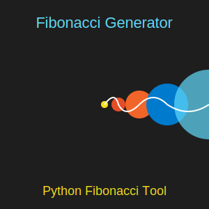

# Fibonacci Generator in Python 🐍
---
[In Python GUI](https://github.com/mdriyadkhan585/fibonacci-sequence-generator-gui)

[In C Script](https://github.com/mdriyadkhan585/fibonacci-sequence-generator)




---
This is a Python program that generates the Fibonacci sequence up to a specified number of terms. It’s perfect for learning about the Fibonacci sequence and improving Python programming skills.

### 📚 Table of Contents
1. [Features](#features)
2. [How the Program Works](#how-the-program-works)
3. [How to Run the Program](#how-to-run-the-program)
4. [Sample Output](#sample-output)
5. [FAQs](#faqs)

---

## 🌟 Features <a name="features"></a>
- Generates the Fibonacci sequence up to any given number of terms.
- Friendly terminal interface with formatted output.
- Handles invalid inputs with appropriate error messages.
- Beginner-friendly Python code.

---

## 🧠 How the Program Works <a name="how-the-program-works"></a>
1. **Input**: The user is asked to input a positive integer for the number of terms in the Fibonacci sequence.
   - If the input is valid, the program calculates and displays the Fibonacci sequence up to the specified number.
   - If the input is invalid (e.g., non-integer or negative), the program prompts the user to enter a valid number.

2. **Processing**: The Fibonacci sequence is generated using a simple iterative approach where each term is the sum of the two preceding ones:
   ```
   F(n) = F(n-1) + F(n-2)
   ```

3. **Output**: The program prints the Fibonacci sequence up to the desired number of terms, with clear formatting for easy reading.

---

## 🖥️ How to Run the Program <a name="how-to-run-the-program"></a>

### Step 1️⃣: Install Python
Ensure you have Python installed on your machine. If not, download it from the official website: [Python Download](https://www.python.org/downloads/).

### Step 2️⃣: Download the Source Code
Clone or download this repository:
```bash
git clone https://github.com/mdriyadkhan585/https://github.com/whoisni30/fibonacci-generator.git
cd fibonacci-generator
```

### Step 3️⃣: Run the Program
You can run the Python script by navigating to the directory and executing the following command:
```bash
python fibonacci.py
```

You will see the following prompt in the terminal:
```
====================================
     Fibonacci Sequence Generator   
====================================
Enter the number of terms you want to generate: 
```

---

## 👀 Sample Output <a name="sample-output"></a>

Here’s an example of the program’s output when the user enters `6` as the number of terms:

```
====================================
     Fibonacci Sequence Generator   
====================================
Enter the number of terms you want to generate: 6

Fibonacci Sequence up to 6 terms:
0, 1, 1, 2, 3, 5

====================================
           Program Ended            
====================================
```

- If the user enters a non-positive number or an invalid input:
  ```
  Please enter a valid positive integer.
  ```

---

## ❓ FAQs <a name="faqs"></a>

### 1. What is the Fibonacci Sequence? 
The Fibonacci sequence is a series of numbers in which each number is the sum of the two preceding numbers. It typically starts with 0 and 1.

### 2. Can I generate an infinite sequence?
This program generates a finite sequence based on the number of terms you specify. To generate an infinite sequence, you’d need to modify the code or run it in an infinite loop (though this is not recommended for normal use).

### 3. Can I use this program to learn Python?
Absolutely! This program is beginner-friendly, and the code is well-structured to help new Python learners understand loops, conditionals, and basic error handling.

---

## 📝 License
This project is licensed under the MIT License. See the [LICENSE](LICENSE) file for more details.

Happy coding! 💻✨

---
